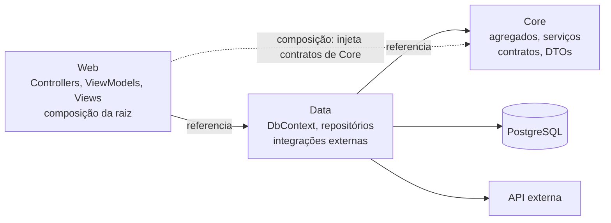
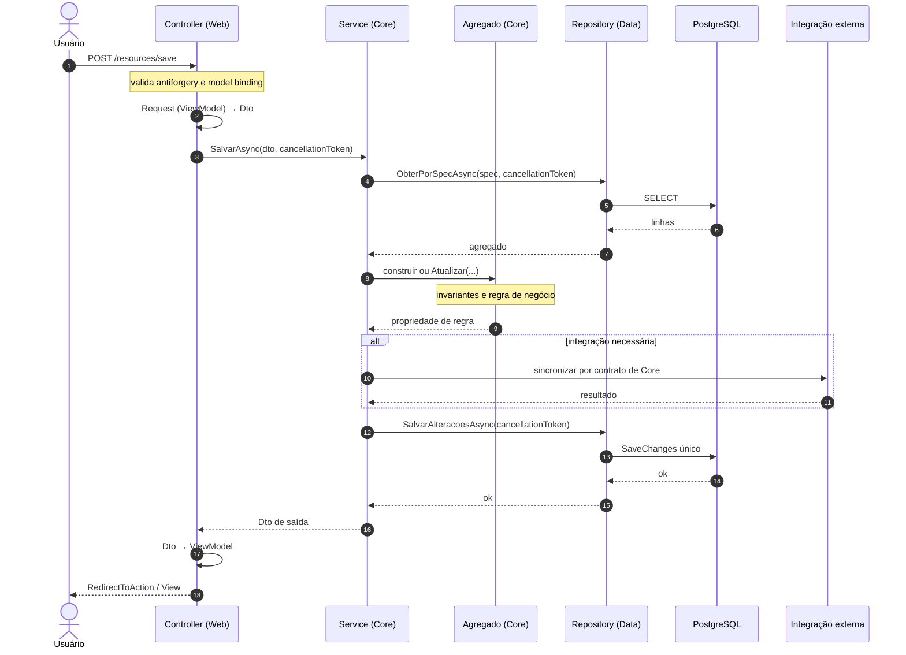
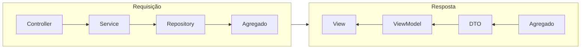
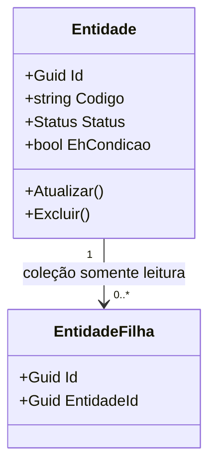
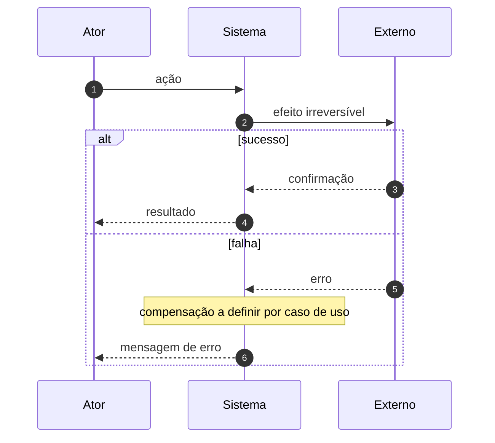
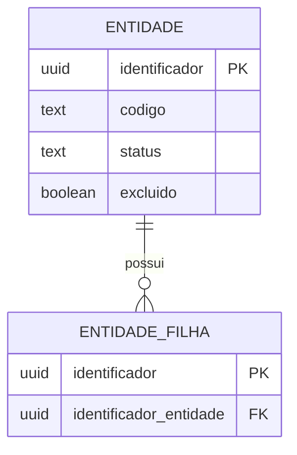
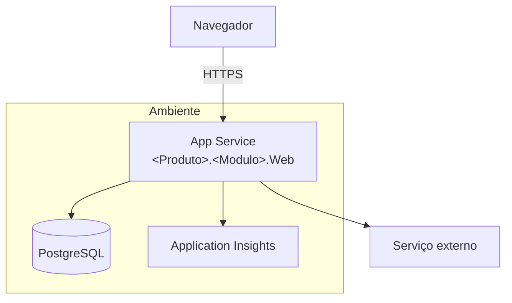
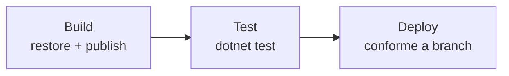

# Diagramas

> **Template do boilerplate.** Preencha ao implementar e remova este aviso.

Diagramas em Mermaid, versionados como texto. Imagem exportada não entra no repositório: ela
desatualiza em silêncio e ninguém consegue revisar um `.png` num diff.

Os dois primeiros diagramas são **fixos pelo boilerplate** — descrevem a norma, valem em qualquer
projeto e não devem ser editados por projeto. Os demais são placeholders: o projeto os preenche.

Referência normativa: [../../.ai/docs/estrutura-arquitetura.md](../../.ai/docs/estrutura-arquitetura.md).

## Direção de dependência — fixo pelo boilerplate

Corresponde a `Web ──► Data ──► Core`, com a seta direta `Web ──► Core` existindo apenas para
composição. Nenhuma seta aponta para `Web`, e nenhuma sai de `Core`.



Leitura do diagrama:

- A seta tracejada `Web ⇢ Core` é composição — o Controller injeta `I<Entidade>Service` declarado em
  `Core.Interfaces.Services`. **Nunca** serve para pular a camada de dados.
- Banco e API externa penduram em `Data`, nunca em `Core`: o domínio conhece o contrato, não o
  transporte.
- `Core` não tem seta de saída. Se algum dia tiver, o desenho está errado.

## Fluxo de uma requisição — fixo pelo boilerplate

Escrita atravessando as três camadas, com persistência única ao final.



Pontos que o diagrama trava:

- O Controller nunca fala com `Repo` nem com `Banco`.
- A regra vive no agregado; o serviço consulta e reage.
- Existe **um** `SaveChanges`, no fim.
- A integração externa é opcional e não participa da transação do banco — ver
  [data-flow.md](data-flow.md).

## Responsabilidade por artefato — fixo pelo boilerplate

Ida e volta usam artefatos diferentes de propósito: na ida o dado converge para o domínio, na volta
diverge para a tela.



## Modelo de domínio — preencher

*Um diagrama de classes com os agregados deste projeto, suas entidades filhas e as relações entre
eles. Mostre a raiz de cada agregado e a fronteira de consistência — o que entra junto no mesmo
`SaveChanges`. Relação entre agregados é por identificador, nunca por navegação direta.*

*Se o diagrama ficar grande demais para caber numa tela, é sinal de que há mais de um domínio aqui:
o critério de separação está na seção 18 da referência normativa.*



## Sequência dos casos de uso críticos — preencher

*Um `sequenceDiagram` por caso de uso onde errar dói: cobrança, exclusão de conta, integração
irreversível, qualquer fluxo com efeito colateral externo. Caso de uso de CRUD simples não merece
diagrama — ele já está descrito pelo fluxo canônico acima.*

*Para cada um, deixe explícito o que acontece quando o passo externo falha depois do banco ter
gravado. Essa é a informação que o diagrama tem e a prosa esquece.*



## Modelo de dados — preencher

*Um `erDiagram` com as tabelas de que este projeto é dono, e — separadas visualmente — as tabelas
consumidas de outro sistema. Marcar o papel de cada schema aqui evita a migration acidental sobre
schema alheio.*



Identificadores em PostgreSQL vão **por extenso** — sem abreviação, sigla ou diminutivo.

## Deploy — preencher

*A topologia real: onde a aplicação roda, onde o banco vive, quais recursos externos existem e por
onde o tráfego entra. Inclua os ambientes e o que difere entre eles. O diagrama existe para
responder "o que preciso provisionar para subir isso do zero?".*



## Pipeline — preencher

*Os stages e as dependências entre eles. O ponto de atenção fixo: `Deploy` depende de **`Test`**, não
apenas de `Build` — caso contrário uma falha de teste não bloqueia o deploy.*



## Convenções destes diagramas

- Mermaid em bloco ` ```mermaid `, nunca imagem exportada.
- Rótulo em português, no idioma do domínio; nome de artefato como está no código.
- Um diagrama responde uma pergunta. Diagrama que tenta mostrar tudo não é lido por ninguém.
- Diagrama desatualizado é pior que ausente: se a mudança altera estrutura, o diagrama é atualizado
  na mesma entrega.
